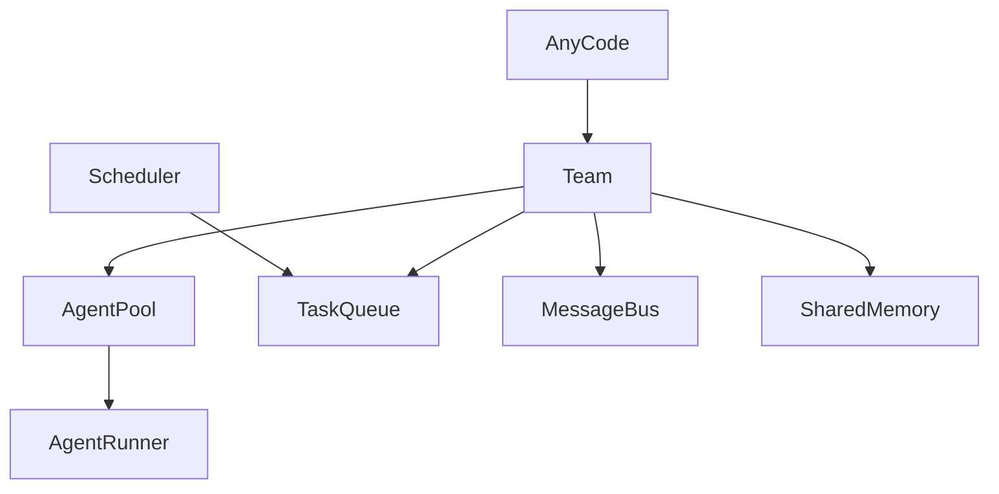

# AnyCode Agents And Teams

In AnyCode, an agent defines how one model behaves, and a team defines which agents collaborate on a goal and how their work is ordered. Keeping those two ideas separate is what lets you reuse a reviewer agent across projects while changing the team it works in.

This page explains how AnyCode agents and teams fit together: how you configure each one, how tasks get assigned, how dependencies order the run into concurrent waves, and when to let an agent hand work to a teammate at runtime.



## Agent Configuration

An agent is defined by `AgentConfig`, the single input that names the model, provider, system prompt, tool permissions, and limits for one role:

```python title="AgentConfig for a reviewer agent"
from anycode import AgentConfig

agent = AgentConfig(
    name="reviewer",
    provider="anthropic",
    model="claude-haiku-4-5",
    system_prompt="Review code changes for correctness and test coverage.",
    tools=["file_read", "grep"],
    max_turns=6,
    temperature=0,
)
```

The `tools` list is a permission list, not an import. A tool must be registered in the agent's registry before that agent can call it, so `["file_read", "grep"]` grants the reviewer read and search access and nothing more. Scoping tools this way keeps each agent to the minimum surface it needs.

## Team Configuration

A `TeamConfig` groups agents under one name and controls the behavior they share: whether they use team memory, and how many can run at once.

```python title="TeamConfig for an implementation crew"
from anycode import AgentConfig, TeamConfig

team_config = TeamConfig(
    name="implementation-crew",
    shared_memory=True,
    max_concurrency=3,
    agents=[
        AgentConfig(name="planner", provider="openai", model="gpt-4o-mini"),
        AgentConfig(name="builder", provider="openai", model="gpt-4o-mini", tools=["file_read", "file_write"]),
        AgentConfig(name="reviewer", provider="openai", model="gpt-4o-mini", tools=["file_read", "grep"]),
    ],
)
```

Two settings shape how a team behaves:

| Setting | What it controls |
| --- | --- |
| `shared_memory` | When `True`, agents coordinate through team memory. Keep it on when agents need continuity across tasks; turn it off for isolated runs. |
| `max_concurrency` | The upper bound on how many agents the `AgentPool` runs at the same time. |

Notice that agents can mix providers and models inside one team, so a cheaper model can plan while a stronger one reviews.

## Task Assignment

You can assign a task to a named agent directly with `TaskSpec`:

```python title="Assign a task with a dependency"
from anycode import TaskSpec

TaskSpec(
    title="Review implementation",
    description="Check the implementation and list concrete fixes.",
    assignee="reviewer",
    depends_on=["Implement feature"],
)
```

If you leave `assignee` off, the scheduler can route a ready task to an available agent based on the configured strategy. Explicit assignment gives you control over who does what; leaving it open lets the runtime balance work across the team.

## Dependency Ordering

Task order in AnyCode comes from dependencies, not from list position. AnyCode runs a topological sort over the `depends_on` edges: tasks whose dependencies are all satisfied form a wave and run concurrently, and a later wave starts only after the tasks it depends on finish.

This structure keeps prompt context explicit. A reviewer task receives the builder's result because the dependency edge says the reviewer depends on that output, so context flows along edges you can see rather than through implicit ordering. If an upstream task fails, its dependents are blocked instead of running without the input they needed.

## Handoff

Handoff is the runtime alternative to a fixed dependency edge. An agent can pass work to another agent when the handoff tool or handoff policy is enabled. The orchestrator validates that the target agent belongs to the team, executes the target agent, and records the handoff chain on the team result.

The two coordination styles solve different problems:

| Approach | Use it when | How it works |
| --- | --- | --- |
| `depends_on` edges | The workflow shape is known before the run | The scheduler orders tasks topologically and passes upstream results downstream |
| Handoff | Who continues the work is a runtime judgment | An agent hands off to a teammate; the orchestrator checks team membership and records the handoff chain |

Reach for `depends_on` when you can draw the graph up front, and for handoff when an agent should decide mid-run who is best placed to continue.

## Next steps

- [Run a multi-agent team](../guides/multi-agent-team.md) with dependencies end to end.
- [Configure teams in YAML](../guides/yaml-config.md) instead of Python.
- [Review the runtime model](overview.md) that agents and teams sit inside.
- [Look up exact signatures](../reference/public-api.md) in the public API reference.
