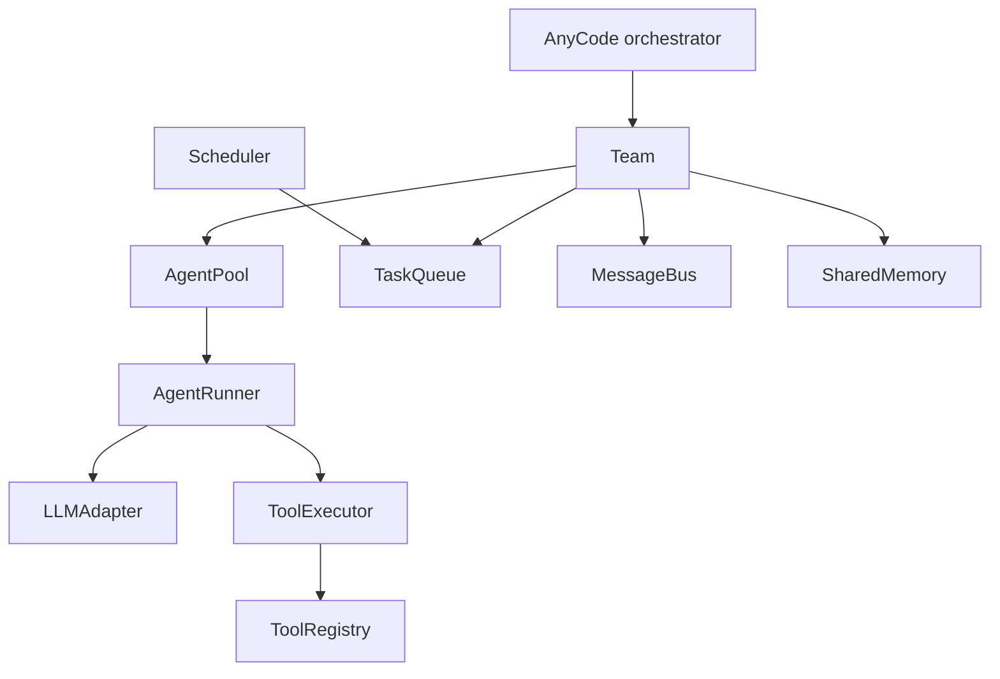

# AnyCode Concepts Overview

AnyCode is an async-first orchestration layer that coordinates LLM agents, tools, and tasks behind one runtime you can inspect. The framework owns the harness: agent configuration, tool execution, task scheduling, shared memory, lifecycle events, and verification all run through the same path. Provider adapters and tools stay replaceable.

A single model call answers a single prompt. Real work usually needs several: a plan, an implementation, a review, and a check that the result holds up. AnyCode treats that as an explicit graph of agents and tasks instead of a chain of hand-wired prompts, so you can see where work is, why each step ran, and what it cost. This page maps the pieces of that runtime and how they connect.

!!! warning "Alpha, and moving"
    AnyCode is alpha software. APIs, defaults, and configuration formats can change between releases. It is built for prototypes, evaluation harnesses, and research, not yet for production workloads.

## The AnyCode Runtime Model

The AnyCode runtime is a small set of components with clear ownership. The orchestrator sits at the top, a team coordinates agents, and each agent runs through a provider adapter and a tool executor.



The same runtime reads cleanly as a text tree, which also shows the two cross-cutting layers, verification gates and memory, that wrap every run:

```text title="Runtime ownership, top to bottom"
AnyCode orchestrator
  -> Team
      -> AgentPool
          -> AgentRunner
              -> LLMAdapter
              -> ToolExecutor
                  -> ToolRegistry
      -> TaskQueue
  -> Verification gates
  -> Memory and checkpoints
```

Each component has one job:

| Component | Responsibility |
| --- | --- |
| `AnyCode` | Top-level orchestrator: builds teams and agents, runs tasks, emits lifecycle events, tracks cost, and applies verification gates |
| `Team` / `TeamConfig` | Groups agents under one name, optionally shares memory, and bounds concurrency |
| `AgentPool` | Runs agents concurrently within the configured limit |
| `TaskQueue` / `Scheduler` | Orders task specs by dependency and dispatches each ready wave |
| `AgentRunner` | Turns an `AgentConfig` into a provider conversation loop |
| `LLMAdapter` | Provider-agnostic protocol for model calls |
| `ToolExecutor` / `ToolRegistry` | Validates tool inputs and runs registered tools |
| `MessageBus` / `SharedMemory` | Inter-agent messaging and shared team state |

## The Orchestrator

`AnyCode` is the top-level runtime. It creates teams, builds agents, connects MCP servers, installs plugins, runs tasks, emits lifecycle events, tracks cost, and applies team-level verification gates.

There are three ways to start work, and picking the right one keeps the rest simple:

| Entry point | Use it when |
| --- | --- |
| `run_agent()` | You have a single prompt for one agent |
| `run_tasks()` | You already know the task graph |
| `run_team()` | You want a coordinator agent to decompose a goal into tasks |

## Agents

An agent is configured with `AgentConfig`: name, model, provider, system prompt, tool names, limits, context policy, and verification sensors. The `AgentRunner` converts that configuration into a provider conversation loop.

Agent configuration is immutable. Agents do not mutate their Pydantic configuration at runtime; when a feature needs derived settings, AnyCode creates an updated model instance instead of editing the original. That immutability is what makes a run reproducible and auditable.

## Teams

A `TeamConfig` groups agents under one team name. Teams can share memory and run through a bounded `AgentPool`, so several agents can work at once while staying inside the configured concurrency limit.

Shared memory is the coordination surface. Enable it when agents need continuity across tasks, and keep it off for runs you want fully isolated. The [agents and teams guide](agents-and-teams.md) covers configuration in detail.

## Tasks And Waves

`TaskSpec` defines a task title, description, optional assignee, and optional dependencies. AnyCode turns task specs into immutable task records, validates the dependencies, orders them with a topological sort, and runs each ready wave concurrently.

Dependencies do more than sequence work. When a task fails, its downstream dependents are blocked rather than run with missing context, so a broken plan never silently poisons the review that depends on it. This cascading failure handling is what separates a task graph from a list of prompts.

## Providers

Provider adapters implement the `LLMAdapter` protocol. Built-in adapters cover Anthropic, OpenAI, Google Gemini, Ollama, AWS Bedrock, and Azure OpenAI, and agents in the same team can use different providers and models. Plugin providers register through the same protocol without changing AnyCode internals, so bringing your own model means implementing one interface.

## Tools

Tools are Pydantic-validated functions registered in a `ToolRegistry`. The built-in set covers shell execution (`bash`), file read, write, and edit (`file_read`, `file_write`, `file_edit`), search (`grep`), and file listing. Custom tools use `define_tool()` with a Pydantic input model and an async execute function, and they run through the same validation path as the built-ins.

An agent's `tools` list is a permission list, not an import. A tool must be registered in the agent's registry before that agent can call it. The [tools guide](../guides/tools.md) walks through registering and scoping tools.

## Runtime Controls

Everything above is enough to run a team. The controls below are opt-in, so simple experiments stay small and only pay for the machinery they use:

- Guardrails and output validators.
- Human approval gates.
- Cost budgets and cost reports.
- Context pressure management.
- RAG memory and vector stores.
- Checkpointing and durable run stores.
- Verification sensors such as `ruff`, `pyright`, `pytest`, `schema`, `regex`, and custom sensors.

Verification sensors run as quality gates that can block a bad result rather than return it. The [production controls guide](../guides/production-controls.md) shows how to wire them into a run.

## Next steps

- [Install AnyCode](../getting-started/installation.md) and set up a project.
- [Run a multi-agent team](../guides/multi-agent-team.md) end to end.
- [Learn how agents and teams fit together](agents-and-teams.md) in depth.
- [Browse the public API reference](../reference/public-api.md) for exact signatures.
