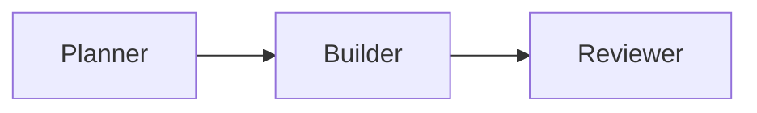

# Contributing to AnyCode Documentation

This guide shows you how to write, preview, and ship changes to the AnyCode documentation so that every page reads well for developers, ranks in search, and stays useful to coding agents.

The docs live in Markdown under `site_docs/`, build with **MkDocs Material**, and deploy to **GitHub Pages** as a versioned site. You never need a Node toolchain — everything runs through `uv` and Python.

## The docs stack at a glance

| Piece | What it does |
| --- | --- |
| **MkDocs Material** | Static site generator + theme (search, nav tabs, dark mode, code copy). |
| **mkdocstrings** | Generates the Python API reference from docstrings in `src/`. |
| **mike** | Publishes each release as a selectable version with a `latest` alias. |
| **social plugin** | Renders Open Graph card images (CI only — needs Cairo system libs). |
| **`overrides/main.html`** | Injects JSON-LD structured data, the canonical URL, and robots meta. |
| **`overrides/home.html`** | The custom hero used by the landing page (`index.md`). |
| **`stylesheets/extra.css`** | The indigo/violet brand theme (Inter + JetBrains Mono). |

## Run the docs locally

Install the docs toolchain (it lives in the project's `dev` dependency group) and start the live-reload server:

```bash
uv sync --group dev
uv run python -m mkdocs serve
```

Open <http://127.0.0.1:8000>. The server watches `site_docs/`, `src/`, and `overrides/`, so edits to pages, docstrings, and templates all reload automatically.

Before you open a pull request, run the same **strict** build that CI runs:

```bash
uv run python -m mkdocs build --strict
```

Strict mode fails on broken internal links, snippet errors, and pages that are missing from the nav — fix every warning before pushing.

!!! tip "Social cards stay off locally"
    The `social` plugin is enabled only when `CI=true` because it needs Cairo imaging libraries. Local `serve` and `build` skip card generation, which is expected — CI generates the cards for the published site.

If your change also touches docstrings or anything under `src/` (the API reference reads from there), run the repository gate too:

```bash
uv run ruff check src/ && uv run ruff format --check src/ && uv run pyright && uv run python -m pytest
```

## Choose the right page type

AnyCode follows the [Diátaxis](https://diataxis.fr/) model. Pick the type that matches the reader's job, and don't blend all four into one page.

| Type | Reader need | Good fit |
| --- | --- | --- |
| Tutorial | Learn by doing | Quickstart and first workflow |
| How-to guide | Complete a concrete task | Add tools, use YAML config, enable gates |
| Reference | Look up exact behavior | Public API and CLI commands |
| Explanation | Understand the model | Orchestrator, teams, scheduling, context |

A quickstart should keep moving; a reference page should be predictable. Keeping the types distinct also makes each section cleaner for search engines and agents to retrieve.

## Add a new page

1. **Create the Markdown file** in the section folder that fits its type, for example `site_docs/guides/my-topic.md`.
2. **Register it in the nav.** Open `mkdocs.yml` and add an entry under the right section:

    ```yaml
    nav:
      - Guides:
          - Run a Multi-Agent Team: guides/multi-agent-team.md
          - My Topic: guides/my-topic.md   # new
    ```

3. **Add frontmatter** (see below), then write the body starting with a single H1.
4. **Rebuild strictly** — a page left out of the nav fails the `--strict` build.

### Frontmatter

Every page starts with a YAML block. Use it to drive titles, snippets, and metadata:

| Field | Required | Purpose |
| --- | --- | --- |
| `title` | Recommended | Sets the `<title>`, the JSON-LD headline, and the browser tab. Include a target keyword and "AnyCode". Falls back to the H1 if omitted. |
| `description` | **Yes** | The meta description and search snippet. Keep it to **150–160 characters**, plain language, no keyword stuffing. |
| `keywords` | Optional | Injected as `<meta name="keywords">` by `overrides/main.html`. A short, comma-separated list. |

```yaml
---
title: "Run a Multi-Agent Team — AnyCode"
description: Build a planner, builder, and reviewer team in AnyCode with dependency-aware tasks, shared memory, and typed results in a few dozen lines of Python.
keywords: multi-agent team python, agent task graph, dependency-aware scheduling, shared memory agents
---
```

## Write rich content

Material and the enabled `pymdownx` extensions give you the building blocks below. Prefer these native features over raw HTML.

### Admonitions

```markdown
!!! note "Optional title"
    Callout body. Also available: tip, warning, danger, example.

??? note "Collapsed by default"
    Use `???` for a collapsible block.
```

### Content tabs

Tabs are ideal for install options or provider variants. `content.tabs.link` keeps the reader's choice in sync across the page.

````markdown
=== "uv"
    ```bash
    uv add anycode-py
    ```

=== "pip"
    ```bash
    pip install anycode-py
    ```
````

### Diagrams

Fenced `mermaid` blocks render natively — no extra plugin:

````markdown

````

### Code blocks

Fenced code gets a copy button automatically. Use language hints for highlighting and `# (1)!` markers for annotations:

````markdown
```python
engine = AnyCode(max_concurrency=3)  # (1)!
```

1. Cap how many agents run at once.
````

### API reference with mkdocstrings

Pull documentation straight from source docstrings with a `:::` directive. The Python handler reads from `src/`, so keep Google-style docstrings accurate:

```markdown
::: anycode.AnyCode
```

## SEO and agent visibility

Good structure does most of the SEO work here — the theme handles the rest automatically.

- Put the primary query or task in the H1 **and** the opening sentence.
- Give every page a plain-language `description`; use descriptive URLs and stable headings.
- Keep sections self-contained with copyable commands so agents can retrieve them cleanly.
- Link related pages together with descriptive anchor text.

You do **not** hand-write meta tags. `overrides/main.html` injects the canonical URL, robots directives, and JSON-LD (`WebSite`, `Organization`, `SoftwareSourceCode`, and a per-page `TechArticle`), while Material emits Open Graph and Twitter cards.

!!! note "Keep `/llms.txt` current"
    `site_docs/llms.txt` is the curated entry point for coding agents and points at the `latest` alias. When you add, rename, or move an important page, update its link there in the same pull request.

## Versioning and deployment

The site is **versioned with `mike`**. Published URLs carry the version (for example `…/anycode/latest/` or `…/anycode/0.6/`), and readers switch releases from the version dropdown in the header.

You almost never run `mike` by hand — CI (`.github/workflows/docs.yml`) does the work:

- **On pull requests** — the `validate` job installs the Cairo imaging libraries and runs `uv run python -m mkdocs build --strict` with `CI=true`, so broken links, missing nav entries, and social-card errors all block the merge.
- **On push to `main` or a `v*` tag** — the `deploy` job resolves the version from `pyproject.toml`, then runs `uv run mike deploy --push --update-aliases <minor> latest --title <full>` followed by `uv run mike set-default --push latest`, publishing to the `gh-pages` branch that GitHub Pages serves.

To preview the versioned experience locally (optional), use `uv run mike serve`.

## Language switcher (Python / TypeScript)

The header includes a **Python / TypeScript** language dropdown, configured under `extra.alternate` in `mkdocs.yml`. Python is the live SDK; the TypeScript SDK is planned, and its placeholder page lives at [`../typescript/index.md`](../typescript/index.md). When the TypeScript docs land, mirror the Python page paths so the switcher lines up.

## Where assets and overrides live

| Path | What it holds |
| --- | --- |
| `site_docs/` | All Markdown source (`docs_dir`). |
| `site_docs/assets/` | `logo.svg`, `favicon.svg`, and images. |
| `site_docs/stylesheets/extra.css` | Brand theme (indigo/violet, Inter + JetBrains Mono, hero, nav). |
| `site_docs/llms.txt` | Agent-facing index, served at the site root. |
| `site_docs/robots.txt` | Crawler rules and the sitemap pointer. |
| `overrides/main.html` | JSON-LD, canonical + robots meta, and the alpha announce banner. |
| `overrides/home.html` | The custom landing hero (used by `index.md`). |
| `mkdocs.yml` | Site config: nav, theme, plugins, and `extra`. |
| `site/` | Build output — generated, not committed. |

## Pre-PR checklist

- [ ] New page has `title`, a 150–160 char `description`, and (optionally) `keywords`.
- [ ] Page is registered in the `nav` in `mkdocs.yml`.
- [ ] `uv run python -m mkdocs build --strict` passes with no warnings.
- [ ] `/llms.txt` updated if you added or moved an important page.
- [ ] Docstring or `src/` changes pass the repository gate (ruff, pyright, pytest).
- [ ] Release-affecting changes update the relevant page and changelog together.

## Next steps

- [Documentation strategy and case studies](documentation-strategy.md)
- [Public API reference](../reference/public-api.md)
- [AnyCode documentation home](../index.md)
