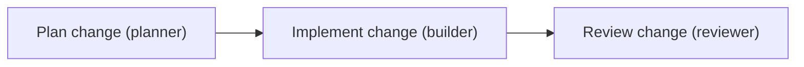

# Run a Multi-Agent Team

Run a multi-agent team in AnyCode by creating an engine, defining role-scoped agents, wiring tasks with explicit dependencies, and awaiting `run_tasks`. This guide builds a three-agent crew, planner then builder then reviewer, that passes work down a dependency chain and returns one structured result you can inspect.

A single agent is enough for a one-shot task. Reach for a team when the work has distinct roles, when one step must finish before the next begins, or when you want each stage to be auditable on its own. AnyCode schedules the tasks as a directed graph, runs independent work concurrently up to a concurrency limit, and collects every agent's output into a single `TeamRunResult`.

!!! note "Prerequisites"
    Install the framework with a provider extra such as `uv add "anycode-py[anthropic]"` and set the matching provider key. See [Installation](../getting-started/installation.md) and the [Quickstart](../getting-started/quickstart.md) if you have not run an agent yet.

## When to use a multi-agent team

The crew in this guide splits one change across three roles, each with its own model, system prompt, and tool access. The reviewer never writes files; the planner never touches the repository at all.

| Agent | Model | Tools | Job |
| --- | --- | --- | --- |
| `planner` | `claude-haiku-4-5` | none | Produce a short plan with risks and a validation step |
| `builder` | `claude-haiku-4-5` | `file_read`, `file_write`, `file_edit`, `grep` | Implement the plan and report changed files |
| `reviewer` | `claude-haiku-4-5` | `file_read`, `grep` | Review the change for bugs, risks, and missing tests |

Tasks flow in dependency order, so the builder starts only after the planner finishes, and the reviewer starts only after the builder finishes:



## Step 1: Create the orchestration engine

The `AnyCode` engine owns the runtime: scheduling, concurrency, shared memory, and results. Set `max_concurrency` to cap how many agents run at the same time.

```python title="team.py"
from anycode import AnyCode

engine = AnyCode(config={"max_concurrency": 3})
```

## Step 2: Define role-scoped agents

Each `AgentConfig` binds a name to a provider, a model, a system prompt, and a tool allowlist. Give every agent only the tools its job requires. Narrow tool access keeps behavior easier to reason about and limits what a single agent can do if a prompt goes wrong.

```python title="team.py"
from anycode import AgentConfig, TeamConfig

planner = AgentConfig(
    name="planner",
    provider="anthropic",
    model="claude-haiku-4-5",
    system_prompt="Create short implementation plans with risks and checks.",
    tools=[],
)

builder = AgentConfig(
    name="builder",
    provider="anthropic",
    model="claude-haiku-4-5",
    system_prompt="Implement the plan carefully and report changed files.",
    tools=["file_read", "file_write", "file_edit", "grep"],
)

reviewer = AgentConfig(
    name="reviewer",
    provider="anthropic",
    model="claude-haiku-4-5",
    system_prompt="Review the implementation for bugs, risks, and missing tests.",
    tools=["file_read", "grep"],
)
```

!!! tip "Mix providers in one team"
    Agents in the same team can use different providers and models. You could keep the planner on a fast model and route the reviewer to a stronger one, for example. See [Work With Tools](tools.md) for how tool names map to built-in capabilities.

## Step 3: Assemble the team

`create_team` registers the agents under a team name. Turn on `shared_memory` so agents can read what earlier agents recorded, and set `max_concurrency` at the team level to bound parallel work.

```python title="team.py"
team = engine.create_team(
    "implementation-crew",
    TeamConfig(
        name="implementation-crew",
        shared_memory=True,
        max_concurrency=3,
        agents=[planner, builder, reviewer],
    ),
)
```

## Step 4: Model the task graph with dependencies

A `TaskSpec` describes one unit of work. Two fields drive coordination: `assignee` points at an agent by name, and `depends_on` lists the task titles that must complete first. AnyCode topologically sorts these tasks and executes each dependency wave before the next.

```python title="team.py"
from anycode import TaskSpec

tasks = [
    TaskSpec(
        title="Plan change",
        description="Plan a small feature and include a validation command.",
        assignee="planner",
    ),
    TaskSpec(
        title="Implement change",
        description="Implement the planned feature and keep the edit focused.",
        assignee="builder",
        depends_on=["Plan change"],
    ),
    TaskSpec(
        title="Review change",
        description="Review the implementation and identify any fixes before merge.",
        assignee="reviewer",
        depends_on=["Implement change"],
    ),
]
```

!!! warning "Task titles are dependency identifiers"
    `depends_on` matches on task titles, so keep every title unique within a workflow. A duplicated or misspelled title breaks the dependency link and can let a task run before its inputs are ready.

## Step 5: Run the team and read the result

`run_tasks` is a coroutine, so await it inside an async entry point, for example a `main()` function launched with `asyncio.run`. See the [Quickstart](../getting-started/quickstart.md) for a complete async scaffold.

```python title="team.py"
result = await engine.run_tasks(team, tasks)

print(result.success)
for agent_name, agent_result in result.agent_results.items():
    print(agent_name, agent_result.success)
    print(agent_result.output[:500])
```

The returned `TeamRunResult` contains per-agent outputs, total token usage, handoffs, route decisions, cost reports, lifecycle events, verification results, and gate decisions when those features are enabled. Start with `result.success` for the overall verdict, then walk `result.agent_results` for each role's output and status.

## Operational best practices

These habits keep team runs predictable as they grow, especially once real providers and file edits are involved.

| Practice | Why it matters |
| --- | --- |
| Write specific, auditable task descriptions | Another agent, or you later, can verify the work against a clear brief |
| Prefer explicit dependencies for known workflows | Ordering stays deterministic instead of relying on timing |
| Turn on verification gates for file or network work | A failing lint, type, or test check can block a bad result before it spreads |
| Set cost budgets before live runs | A budget stops a large team from burning tokens against paid providers |
| Test with deterministic fake adapters in CI | Scheduling and coordination logic is exercised without live LLM calls or credentials |

!!! danger "Tool-enabled teams are privileged automation"
    The builder in this crew can read, write, and edit files. Treat any agent with `bash` or file tools as a privileged process: run teams in a disposable workspace, scope each agent to the fewest tools it needs, and add human approval gates for irreversible actions. See [Production Controls](production-controls.md) for budgets, gates, and checkpoints.

## Next steps

- [Work With Tools](tools.md) gives your builder scoped file and shell access, or custom typed tools.
- [Use YAML Config](yaml-config.md) declares the same team and task graph in a reviewable file.
- [Production Controls](production-controls.md) adds cost budgets, approval gates, and verification.
- [Agents and Teams](../concepts/agents-and-teams.md) explains the coordination model behind `run_tasks`.
