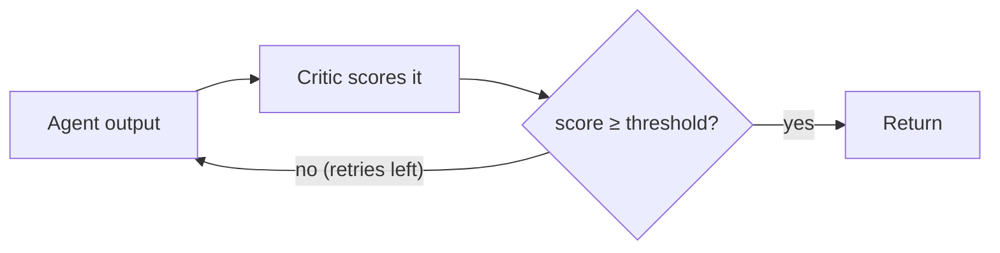

# Self-Reflection

A first draft is rarely the best draft. A reflection loop makes an agent critique its own output and revise it until a critic scores it good enough — trading extra tokens for higher quality on tasks where correctness matters more than latency. This guide covers the three critic modes, the quality threshold, and the iteration budget.

## How the loop works

The agent produces output, a **critic** scores it, and if the score falls short the agent revises with the critic's feedback. This repeats until the score clears the threshold or the iteration budget runs out.



## Enable reflection

Turn it on with a `ReflectionConfig`. The engine then runs each task through the loop instead of a single pass.

```python title="reflection.py"
from anycode import AnyCode, OrchestratorConfig, ReflectionConfig

config = OrchestratorConfig(
    reflection=ReflectionConfig(
        enabled=True,
        mode="self",
        quality_threshold=0.8,
        max_reflections=2,
    ),
)
engine = AnyCode(config)
```

| `ReflectionConfig` field | Default | Effect |
| --- | --- | --- |
| `enabled` | `False` | Reflection is off until you set this |
| `mode` | `"self"` | `self`, `peer`, or `custom` critic |
| `quality_threshold` | `0.7` | Minimum score to accept (0.0–1.0) |
| `max_reflections` | `2` | Revision rounds — total runs is `max_reflections + 1` |
| `critic_model` / `critic_provider` | `None` | Override the critic's model (peer mode) |
| `custom_critic` | `None` | Your own `Critic` implementation (custom mode) |

!!! warning "Budget the extra calls"
    With `max_reflections=2` an agent runs up to **three** times per task, each with a critic call on top — so reflection can roughly triple token spend. Raise the threshold and lower `max_reflections` for latency-sensitive paths; use it generously only where quality justifies the cost.

## Choose a critic mode

| `mode` | Critic |
| --- | --- |
| `"self"` (default) | The agent's own model grades its output |
| `"peer"` | A different model (`critic_model` / `critic_provider`) grades it |
| `"custom"` | Your `custom_critic` object implementing the `Critic` protocol |

Peer review often catches what self-review misses — a stronger or simply different model as critic tends to be more honest about weak output. The built-in `LLMCritic` scores on accuracy, completeness, clarity, and overall quality and returns structured feedback the agent uses to revise.

## Read the outcome

After a reflected run, the result reports how hard the loop worked:

- `reflections_count` — how many revision rounds happened.
- `quality_score` — the accepted critic score (may be `None` if the run ended early).

!!! note "The loop keeps the best attempt"
    If the threshold is never met, reflection returns the **highest-scoring** attempt, not the last one. And `mode="custom"` with `custom_critic=None` silently disables reflection — the run falls through to a single pass with no error.

## Run the loop standalone

Outside the engine, drive `ReflectionLoop` directly:

```python title="loop.py"
from anycode import ReflectionLoop
from anycode.types import AgentInfo

loop = ReflectionLoop(config.reflection)
info = AgentInfo(name="explainer", role="technical writer", model="claude-haiku-4-5")
result = await loop.run(agent, "Explain the CAP theorem precisely.", agent_info=info, agent_provider="anthropic")
```

## The complete, runnable program

The fragments above are pieces of one file. Here is a complete `reflection.py` that turns on self-reflection, builds the agent, drives the loop directly so the counts are visible, and prints how many revision rounds happened and the accepted quality score. It resolves a provider from whichever API key you have set, so it runs on Anthropic or OpenAI without edits.

```python title="reflection.py"
import asyncio
import os
import sys

from dotenv import load_dotenv

from anycode import AgentConfig, AnyCode, OrchestratorConfig, ReflectionConfig, ReflectionLoop
from anycode.types import AgentInfo

load_dotenv()


def resolve_provider() -> tuple[str, str]:
    """Pick a provider and model from whichever API key is set."""
    if os.environ.get("ANTHROPIC_API_KEY"):
        return "anthropic", "claude-haiku-4-5"
    if os.environ.get("OPENAI_API_KEY"):
        return "openai", "gpt-4o-mini"
    sys.exit("Set ANTHROPIC_API_KEY or OPENAI_API_KEY in your environment or .env file.")


PROVIDER, MODEL = resolve_provider()


async def main() -> None:
    config = OrchestratorConfig(
        reflection=ReflectionConfig(
            enabled=True,
            mode="self",
            quality_threshold=0.8,
            max_reflections=2,
        ),
    )
    engine = AnyCode(config)

    agent = engine.build_agent(
        AgentConfig(
            name="explainer",
            provider=PROVIDER,
            model=MODEL,
            system_prompt="You are a precise technical writer. Write clear, accurate explanations.",
            tools=[],
        ),
    )

    # Drive the reflection loop directly so the round count and score are visible.
    loop = ReflectionLoop(config.reflection)
    info = AgentInfo(name="explainer", role="technical writer", model=MODEL)
    result = await loop.run(
        agent,
        "Explain the CAP theorem to a junior engineer in exactly 3 sentences.",
        agent_info=info,
        agent_provider=PROVIDER,
    )

    print(f"reflections_count = {result.reflections_count}")
    print(f"quality_score     = {result.quality_score}")
    print(f"\nFinal output:\n{result.output}")


if __name__ == "__main__":
    asyncio.run(main())
```

Run it from the project root:

```bash
uv run python reflection.py
```

!!! tip "Tested copy"
    See [`examples/14_self_reflection.py`](https://github.com/Quantlix/anycode/blob/main/examples/14_self_reflection.py) for the CI-tested version of this loop.

## Next steps

- [Verify output with quality gates](verification-gates.md) — computational checks (lint, tests) that complement a model critic.
- [Run a multi-agent team](multi-agent-team.md) — add a dedicated reviewer role instead of self-reflection.
- [Track and cap cost](cost-tracking.md) — budget the extra calls reflection makes.
- [Configuration reference](../reference/configuration.md) — every `ReflectionConfig` field.
