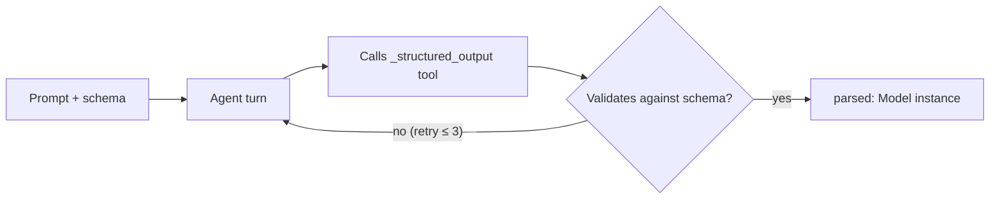

# Structured Output

Free-text answers are hard to program against. AnyCode can force an agent to return a validated **Pydantic object** instead — you define a schema, the agent fills it in, and you get back a typed instance you can index, assert on, or pass downstream. This guide shows the `run_structured` path, the `output_schema` hook, and the low-level helpers underneath.

## Define a schema and run against it

Declare a Pydantic model for the shape you want, build an agent with `output_schema`, then call `run_structured`. The result is a `StructuredAgentResult` whose `parsed` field is an instance of your model.

```python title="structured.py"
from pydantic import BaseModel

from anycode import AnyCode


class Review(BaseModel):
    verdict: str          # "approve" | "request-changes"
    risk: int             # 1-5
    summary: str


async def main() -> None:
    engine = AnyCode()
    agent = engine.build_agent(
        {"name": "reviewer", "provider": "openai", "model": "gpt-4o-mini"},
        output_schema=Review,
    )

    result = await agent.run_structured(
        "Review this change: 'delete the auth check to fix the failing test'.",
        Review,
    )

    if result.success and result.parsed is not None:
        review: Review = result.parsed
        print(review.verdict, review.risk)
        print(review.summary)
```

The returned `StructuredAgentResult` carries:

| Field | What it holds |
| --- | --- |
| `success` | Whether the run completed |
| `parsed` | Your validated model instance, or `None` if parsing failed |
| `output` | The raw text output |
| `token_usage` | Input and output token counts |
| `tool_calls` | Tools the agent invoked during the run |

!!! warning "`parsed` can be `None` even when `success` is `True`"
    Parsing never raises — if the model returns malformed JSON after all retries, `parsed` comes back `None`. Always check `result.parsed is not None` before using it.

## How it works

Regardless of provider, AnyCode enforces structure with a **forced tool call**. The runner appends a hidden `_structured_output` tool whose JSON schema is your model, and the agent "answers" by calling it. AnyCode validates the tool input against your schema and retries the turn on a validation failure, up to three attempts. This is why structured output behaves consistently across Anthropic, OpenAI, and the rest — it does not depend on any one provider's native JSON mode.



## Low-level helpers

If you drive an adapter directly instead of through the orchestrator, the same building blocks are public:

| Helper | Purpose |
| --- | --- |
| `schema_to_tool_def(Model)` | Turn a Pydantic model into the `_structured_output` tool definition |
| `schema_to_openai_response_format(Model)` | Build an OpenAI `json_schema` response format |
| `parse_structured_output(raw, Model)` | Parse raw text (incl. fenced ```` ```json ```` blocks) into a model, or `None` |
| `build_retry_prompt(prompt, error)` | Re-prompt text that includes the validation error |

```python title="manual_parse.py"
from anycode import parse_structured_output

parsed = parse_structured_output(raw_text, Review)  # Review | None
```

!!! tip "Design schemas the model can fill"
    Keep fields shallow and name them for what the model should decide (`verdict`, `risk`, `summary`). Add short field descriptions — they flow into the tool schema the provider sees and measurably improve fill quality.

## Next steps

- [Work with tools](tools.md) — the same typed-tool machinery structured output is built on.
- [Get structured, validated runs into production](production-controls.md) — pair schemas with verification gates.
- [Configuration reference](../reference/configuration.md) — `StructuredOutputConfig` and result types.
- [Public API](../reference/public-api.md) — full signatures for the structured-output helpers.
