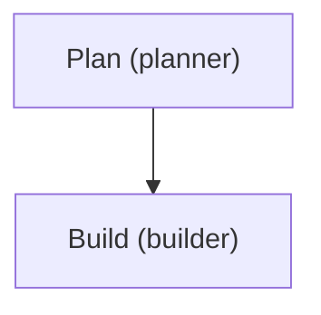

# Visualize Runs

Seeing the shape of a workflow makes it easier to debug and to explain. AnyCode ships two pure-Python renderers: `render_dag` turns a task queue into a dependency diagram, and `render_timeline` charts per-agent activity after a team run. Both return strings — drop them into a terminal, a Markdown file, or a Mermaid block in these docs.

## Render a task DAG

`render_dag` takes a `TaskQueue` and returns the graph in one of four formats. It reads each task's `status`, `assignee`, and `depends_on`, so the diagram reflects live state.

```python title="dag.py"
from anycode import render_dag, TaskQueue
from anycode.tasks.task import create_task

queue = TaskQueue()

plan = create_task(title="Plan", description="Outline the change", assignee="planner")
queue.add(plan)
queue.update(plan.id, status="completed")

build = create_task(title="Build", description="Implement it", assignee="builder", depends_on=[plan.id])
queue.add(build)

print(render_dag(queue, format="ascii"))
print(render_dag(queue, format="mermaid"))
```

Choose a format for the destination:

| `format` | Output | Use it for |
| --- | --- | --- |
| `"mermaid"` (default) | `graph TD` with status-colored nodes | Markdown docs, GitHub, these pages |
| `"dot"` | Graphviz `digraph` | `dot -Tpng` rendering |
| `"json"` | `{"nodes": [...], "edges": [...]}` | Feeding another tool |
| `"ascii"` | Unicode tree with status markers | Terminals and logs |

`show_status=True` (the default) colors or marks nodes by task status: completed, failed, blocked, in-progress, and pending each get a distinct color in Mermaid/DOT and a marker (✓ ✗ ⊘ ▶ ○) in ASCII. An unsupported `format` raises `ValueError`.

The Mermaid output drops straight into a fenced block:



## Chart a team-run timeline

After `run_tasks`, pass the `TeamRunResult` to `render_timeline` for a per-agent bar chart of token activity.

```python title="timeline.py"
from anycode import render_timeline

result = await engine.run_tasks(team, tasks)
print(render_timeline(result, width=40))
```

Each row shows the agent name, a success/failure marker, a bar, and the total tokens the agent used. `width` sets the maximum bar length in characters.

!!! warning "Bars are token proxies, not durations"
    `AgentRunResult` carries no timestamps, so the bars scale to each agent's **token usage**, not wall-clock time. Read the timeline as "who did the most work," not "who took the longest."

## The complete, runnable program

Here is one file that puts both renderers together. It builds a small task queue with mixed statuses and prints the DAG in all four formats — that part is fully offline and always runs. If an API key is set, it then executes a short live team run and renders the timeline; otherwise it prints a skip note and exits cleanly.

```python title="visualize.py"
import asyncio
import os

from dotenv import load_dotenv

from anycode import (
    AgentConfig,
    AnyCode,
    TaskQueue,
    TaskSpec,
    TeamConfig,
    render_dag,
    render_timeline,
)
from anycode.tasks.task import create_task

load_dotenv()


def resolve_provider() -> tuple[str, str] | None:
    """Pick a provider for the live timeline, or None to render the DAG only."""
    if os.environ.get("ANTHROPIC_API_KEY"):
        return "anthropic", "claude-haiku-4-5"
    if os.environ.get("OPENAI_API_KEY"):
        return "openai", "gpt-4o-mini"
    return None


def build_queue() -> TaskQueue:
    """Build a small task graph with mixed statuses to visualize."""
    queue = TaskQueue()

    plan = create_task(title="Plan", description="Outline the change", assignee="planner")
    queue.add(plan)
    queue.update(plan.id, status="completed")

    build = create_task(
        title="Build", description="Implement it", assignee="builder", depends_on=[plan.id]
    )
    queue.add(build)
    queue.update(build.id, status="in_progress")

    review = create_task(
        title="Review", description="Check the change", assignee="reviewer", depends_on=[build.id]
    )
    queue.add(review)
    return queue


async def run_timeline(provider: str, model: str) -> None:
    engine = AnyCode()
    team = engine.create_team(
        "viz-demo",
        TeamConfig(
            name="viz-demo",
            agents=[
                AgentConfig(
                    name="planner",
                    provider=provider,
                    model=model,
                    system_prompt="Produce concise execution plans.",
                    tools=[],
                ),
                AgentConfig(
                    name="builder",
                    provider=provider,
                    model=model,
                    system_prompt="Describe implementation steps briefly.",
                    tools=[],
                ),
            ],
        ),
    )
    tasks = [
        TaskSpec(
            title="Plan",
            description="Outline a release plan for a demo CLI tool in one sentence.",
            assignee="planner",
        ),
        TaskSpec(
            title="Build",
            description="Describe the implementation approach in two sentences.",
            assignee="builder",
            depends_on=["Plan"],
        ),
    ]
    result = await engine.run_tasks(team, tasks)
    print(render_timeline(result, width=40))


async def main() -> None:
    queue = build_queue()

    print(render_dag(queue, format="ascii"))
    print("\n=== Mermaid ===")
    print(render_dag(queue, format="mermaid"))
    print("\n=== Graphviz DOT ===")
    print(render_dag(queue, format="dot"))
    print("\n=== JSON ===")
    print(render_dag(queue, format="json"))

    resolved = resolve_provider()
    if resolved is None:
        print("\nSkipping live timeline: set ANTHROPIC_API_KEY or OPENAI_API_KEY to run it.")
        return
    print("\n=== Timeline (live team run) ===")
    await run_timeline(*resolved)


if __name__ == "__main__":
    asyncio.run(main())
```

Run it from the project root:

```bash
uv run python visualize.py
```

!!! tip "Tested copy"
    See [`examples/16_dag_visualization.py`](https://github.com/Quantlix/anycode/blob/main/examples/16_dag_visualization.py).

## Next steps

- [Run a multi-agent team](multi-agent-team.md) — build the task graph you'll visualize.
- [Track and cap cost](production-controls.md) — pair the timeline with token budgets.
- [Concepts: agents and teams](../concepts/agents-and-teams.md) — the task-graph model behind the DAG.
- [Public API](../reference/public-api.md) — signatures for `render_dag` and `render_timeline`.
