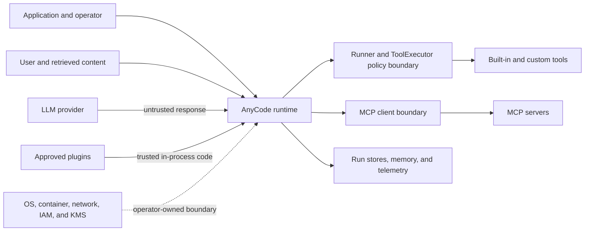

# Security Model and Threat Boundaries

AnyCode treats model output, tool arguments, MCP responses, and persisted artifacts as potentially hostile data. It enforces tool authorization, path and shell policies, side-effect idempotency, scoped MCP visibility, plugin pre-import allowlists, credential redaction, and versioned state. It does not provide an operating-system sandbox, network firewall, identity provider, key manager, or compliance boundary. Production security therefore combines AnyCode controls with host, network, storage, and operational controls.

!!! warning "Workload-specific security"
    AnyCode remains alpha software. This threat model describes the controls in the current documented release, not a certification or a general production guarantee. Pin the package version, review the [compatibility contract](compatibility.md), and complete the [production readiness checklist](../guides/production-readiness.md) for each deployment.

## Security objective

The framework's security objective is narrow: an untrusted model response must not cross an operator-declared tool, MCP, storage, or execution boundary merely because the model requested it. The host application still decides which code, credentials, networks, data, and external systems the process can reach.

The main assets are:

| Asset | What can go wrong |
| --- | --- |
| Credentials and identity tokens | Disclosure to a model, tool, log, plugin, MCP server, or persisted artifact. |
| Files, source code, prompts, and customer data | Unauthorized read, modification, deletion, retention, or external transmission. |
| External systems and side effects | Duplicate, unauthorized, or irreversible actions such as publishing, charging, deleting, or sending. |
| Run state and audit evidence | Tampering, corruption, replay, incomplete retention, or loss during recovery. |
| Provider budget and service capacity | Runaway loops, retry storms, quota exhaustion, or unbounded queues. |
| Runtime availability | Deadlocks, leaked subprocesses, stalled runs, dependency failure, or incomplete shutdown. |

## Trust boundaries

| Component | Trust classification | Required interpretation |
| --- | --- | --- |
| Application code and reviewed configuration | Trusted | The operator owns policy, identities, secrets, deployment topology, and final authorization. |
| User prompts, retrieved documents, and prior tool output | Untrusted data | They can contain prompt injection or instructions intended to redirect tool use. |
| LLM provider responses | Untrusted data | A provider may return malformed or unauthorized tool calls. Tool access is enforced locally. |
| Built-in tools | Trusted code with untrusted inputs | Pydantic validation and local policy constrain inputs, but the process permissions remain authoritative. |
| Custom tools | Trusted in-process code | `ToolSecurityPolicy` cannot stop custom Python from using normal Python APIs. Review and isolate it. |
| MCP server | Operator-approved endpoint with untrusted metadata and output | Scope tools per agent. Treat every discovered MCP tool as side-effecting. |
| Approved plugin | Fully trusted in-process Python | Entry-point allowlists control import. They do not sandbox code after import. |
| Provider SDKs and installed dependencies | Trusted supply chain | Pin, scan, and review dependencies and installation sources. |
| Persistence and telemetry backends | Trusted services holding sensitive data | Apply access control, encryption, retention, backup, and audit outside the framework. |
| Host, container, network, IAM, and key service | Primary security boundary | AnyCode policies supplement these controls and do not replace them. |

## Enforced invariants

The current runtime is designed to preserve these invariants:

1. A provider-returned tool call is rejected when the tool is absent from a non-`None` `AgentConfig.tools` allowlist, even if the tool exists in the registry. An empty list means the agent has no ordinary tools.
2. `ToolSecurityPolicy` is checked at the central `ToolExecutor` boundary for built-in, custom, and MCP calls. Denied tools, paths outside configured roots, disabled shell access, disallowed executables, and filtered environment variables fail before invocation.
3. Side-effecting tools claim an idempotency key before execution. Conflicting, in-progress, or uncertain outcomes fail closed. All discovered MCP tools are side-effecting, regardless of server-supplied `readOnlyHint` metadata.
4. MCP tools are invisible unless an agent opts into the exact configured server name. Tool ownership is recorded at discovery, so overlapping or normalized server-name prefixes do not widen access.
5. A configured MCP bearer-token environment variable must exist and contain a value. A missing credential fails before the HTTP transport opens.
6. MCP connection, initialization, discovery, and agent-attachment failures clean up entered resources and partial registrations. Cancellation remains caller-visible.
7. An entry-point plugin denied by `PluginTrustPolicy` is filtered before `EntryPoint.load()` can import third-party code. Approved plugins remain trusted code.
8. Declarative configuration rejects unknown fields and unsupported future format versions. Checkpoint and durable-run readers reject unsupported future schemas.
9. Recognized credentials are redacted by default at built-in telemetry, checkpoint, run-store, memory, evaluation, and evidence boundaries. Redaction failures do not expose the original exception through built-in logging paths.
10. Telemetry export failures do not change run behavior, and engine shutdown drains owned work before resource teardown.

## Threats, controls, and residual risk

| Threat or failure | Framework control | Operator control and residual risk |
| --- | --- | --- |
| Prompt injection requests a privileged tool | Agent tool allowlist, `ToolSecurityPolicy`, approval gates, and central execution checks | Minimize retrieved content and tool grants. The model can still misuse a tool that the operator allowed. |
| A provider fabricates an unadvertised tool call | The runner enforces `allowed_tools` again at execution | Treat provider output as untrusted and test adapters against malformed responses. |
| Path traversal or symlink escape | Built-in file tools resolve paths and enforce configured roots | Run in a non-root container or VM. Custom tools and host mounts can bypass framework path policy. |
| Shell injection or environment theft | Shell can be disabled; executable allowlists reject control operators; child environments can be filtered | Prefer `allow_shell=False`. An allowed interpreter or launcher can execute arbitrary code through arguments, so OS isolation remains mandatory. |
| Duplicate or uncertain external effects | Atomic idempotency claims, replay, conflict detection, and `side_effect_unknown` terminal outcomes | Use a durable shared claim store and pass the same key to downstream APIs. Reconcile uncertain outcomes before retry. |
| Malicious or compromised MCP server | Exact per-agent scope, HTTPS defaults, host allowlist support, fail-closed auth, timeouts, and side-effect classification | Enforce DNS and egress policy outside AnyCode. Review stdio commands and isolate their processes. MCP output may still contain hostile content. |
| DNS rebinding or hostname resolution to a private address | Private and link-local IP literals are rejected unless allowed | The framework does not resolve DNS for policy enforcement. Use a proxy, firewall, service mesh, or container network allowlist. |
| Malicious plugin or custom tool | Entry-point filtering occurs before import; installation preflights expected conflicts | Approved code runs with host-process privileges. Pin and review it, or move it behind an isolated service boundary. |
| Credential leakage in logs or state | Default-on structured and free-text redaction at built-in boundaries | Redaction is pattern-based, not data-loss prevention. Keep secrets out of prompts and protect custom exporters and active conversations. |
| Persisted-state disclosure or tampering | Versioned formats, atomic writes, path constraints, payload-protector protocol, and corruption fallback | Supply KMS-backed encryption, filesystem permissions, integrity controls, backups, retention, and key rotation. Some metadata remains visible. |
| Runaway cost, quota exhaustion, or retry storm | Turn and token limits, cost budgets, provider bulkheads, request pacing, deadlines, and circuit breaking | Multi-process and multi-host quotas need a provider gateway or distributed limiter. Provider token quotas remain authoritative. |
| Process cancellation or partial initialization | Cancellation propagation, child-task ownership, process-tree cleanup, and MCP rollback | Custom tools must re-raise `asyncio.CancelledError` and release resources in `finally` blocks or context managers. |
| Model gives an incorrect or unsafe answer | Structured output, output validators, computational verification gates, and HITL approval | Model correctness is not guaranteed. Use independent domain checks and keep humans authoritative for consequential decisions. |

## Extension boundaries

### Plugins

`AnyCode.load_installed_plugins()` can discover every installed `anycode.plugins` entry point when called without a policy. That mode is intended for explicit development use. Production code must pass a fail-closed `PluginTrustPolicy` with approved entry-point or distribution names. Filtering occurs before import.

An approved plugin can register tools, provider factories, sensors, and turn hooks inside the process. It can also import modules, open files, access the network, read environment variables, or terminate the process. The plugin allowlist is a supply-chain decision, not a sandbox.

### MCP servers

HTTP MCP validates the URL scheme, embedded credentials, explicit host allowlists, private IP literals, and plaintext transport policy. It does not resolve hostnames to enforce network ranges. Stdio MCP launches operator-configured code and inherits only the MCP SDK's restricted default environment unless an explicit environment mapping is supplied.

An agent receives no MCP tools when `mcp_servers` is omitted or empty. Engine connection is best-effort per server, so a failed server is logged, cleaned up, and withheld while other servers can continue. Monitor these failures as capability loss.

## Data handling boundaries

Default redaction protects built-in persistence and export paths. It does not modify the live prompt, active conversation, provider request, or in-memory tool result. If a workflow puts a credential or regulated record into model context, the configured provider receives it.

`RunPayloadProtector` lets an application provide envelope encryption for durable run payloads. AnyCode does not generate or rotate keys. File and directory names, run IDs, and sizes remain visible. Workflow `FilesystemCheckpointStore` data needs storage-layer encryption when exact replay is retained.

## Explicitly out of scope

AnyCode does not claim to provide:

- An operating-system, container, VM, or language sandbox.
- Network segmentation, DNS rebinding protection, egress filtering, or service-to-service authorization.
- User authentication, tenancy isolation, role-based access control, or an administrative control plane.
- Key generation, KMS or HSM operation, secret rotation, or certificate management.
- Data-loss prevention, malware scanning, content moderation, or prompt-injection elimination.
- Compliance certification, data residency guarantees, privacy impact assessment, or legal approval.
- Distributed provider quota enforcement or a built-in multi-host idempotency service.
- A guarantee that a model, provider, plugin, custom tool, or MCP server is correct or benevolent.

## Verification evidence

Security behavior is covered by executable tests rather than documentation alone:

| Boundary | Primary test modules |
| --- | --- |
| Agent allowlists, tool policy, paths, shell, environment, and idempotency | `tests/test_tool_engine.py`, `tests/test_guardrails.py` |
| MCP trust, auth, scope, cleanup, subprocess lifecycle, and side effects | `tests/test_mcp.py`, `tests/test_mcp_http.py`, `tests/test_mcp_integration.py` |
| Plugin filtering and installation atomicity | `tests/test_plugins.py` |
| Redaction at export and persistence boundaries | `tests/test_security_redaction.py`, `tests/test_telemetry.py`, `tests/test_runstore.py` |
| Cancellation and owned-task cleanup | `tests/test_harness_runtime.py`, `tests/test_tool_engine.py`, `tests/test_resilience.py` |
| API, config, checkpoint, and run-store compatibility | `tests/test_compatibility.py`, `tests/test_config.py`, `tests/test_checkpoint.py`, `tests/test_runstore.py` |

Tests establish framework behavior under their covered conditions. A deployment still needs workload-specific abuse tests, infrastructure controls, and incident drills.

## Next steps

- Complete the [production readiness checklist](../guides/production-readiness.md) before approving a deployment.
- Configure [production controls](../guides/production-controls.md) for budgets, idempotency, approvals, verification, durability, and redaction.
- Apply [tool security policy](../guides/tools.md#enforce-a-workspace-security-policy) and isolate tool-enabled workers.
- Review [MCP trust controls](../guides/mcp.md#restrict-transport-trust) and [plugin trust](../guides/plugins.md#publish-for-auto-discovery) separately.
