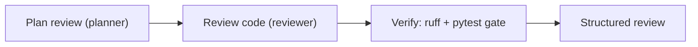

# Build a Code-Review Crew

In this tutorial you'll build a small crew of agents that reviews a code change end to end: one agent plans the review, one reads the code and writes findings, and a verification gate runs the project's own linter and tests so a broken change can't slip through with a cheerful summary. You'll finish with a script you can point at any file or directory in your repo.

**What you'll build:** a `review.py` that takes a target path, runs a planner → reviewer crew over it, gates the result on `ruff` and `pytest`, and prints a structured review — all under a spend ceiling.



!!! note "Prerequisites"
    Install AnyCode on Python 3.12+ and set a provider key (`ANTHROPIC_API_KEY` or `OPENAI_API_KEY`). If you haven't run an agent yet, do the [Quickstart](../getting-started/quickstart.md) first. Install `ruff` and `pytest` in your environment so the gate has real tools to run.

## Step 1: Create the engine with a budget

Start with the `AnyCode` engine and a cost ceiling. A review crew reads files and can loop, so cap spend before the first live call.

```python title="review.py"
import asyncio
import sys

from anycode import AnyCode, CostConfig

engine = AnyCode(config={
    "max_concurrency": 2,
    "cost": CostConfig(budget_usd=0.50, on_budget_exceeded="stop"),
})
```

## Step 2: Define the crew

Two roles, each scoped to the fewest tools it needs. The planner never touches the repo; the reviewer reads but never writes.

```python title="review.py"
from anycode import AgentConfig, TeamConfig

planner = AgentConfig(
    name="planner",
    provider="anthropic",
    model="claude-haiku-4-5",
    system_prompt="Plan a focused code review: list what to check for bugs, risks, and missing tests.",
    tools=[],
)

reviewer = AgentConfig(
    name="reviewer",
    provider="anthropic",
    model="claude-sonnet-5",
    system_prompt=(
        "Review the target code. Read the files, then report concrete findings: "
        "bugs, risks, and missing tests. Be specific and cite file paths."
    ),
    tools=["file_read", "grep", "list_files"],
)
```

!!! tip "Match the model to the job"
    The planner runs on a fast, cheap model; the reviewer — where judgment matters — runs on a stronger one. Mixing models within a team is a one-line change and a real cost lever.

## Step 3: Add a verification gate

Attach a gate to the reviewer so its verdict is backed by the project's own checks, not just prose. `pytest` failures are `critical` (they block); `ruff` failures are `error` (they trigger a retry with feedback).

```python title="review.py"
from anycode.types import VerificationSensorConfig

reviewer = reviewer.model_copy(update={
    "verification": (
        VerificationSensorConfig(name="ruff", kind="computational", phases=("after_task",),
                                 options={"target": "src/"}),
        VerificationSensorConfig(name="pytest", kind="computational", phases=("after_task",),
                                 options={"target": "tests/"}),
    ),
})
```

## Step 4: Wire the task graph

The review flows in order: plan first, then review against that plan.

```python title="review.py"
from anycode import TaskSpec

def build_tasks(target: str) -> list[TaskSpec]:
    return [
        TaskSpec(
            title="Plan review",
            description=f"Plan a code review for: {target}",
            assignee="planner",
        ),
        TaskSpec(
            title="Review code",
            description=f"Review the code at {target} following the plan. Report concrete findings.",
            assignee="reviewer",
            depends_on=["Plan review"],
        ),
    ]
```

## Step 5: Run it and read the result

Assemble the team, run the tasks, and print each role's output plus the gate outcome and cost.

```python title="review.py"
async def main() -> None:
    target = sys.argv[1] if len(sys.argv) > 1 else "src/"

    team = engine.create_team(
        "review-crew",
        TeamConfig(name="review-crew", shared_memory=True, agents=[planner, reviewer]),
    )

    result = await engine.run_tasks(team, build_tasks(target))

    print(f"success={result.success}")
    for name, agent_result in result.agent_results.items():
        print(f"\n=== {name} ===\n{agent_result.output}")

    for decision in result.gate_decisions:
        print(f"\ngate: {decision.outcome} — {decision.message}")

    if result.cost_report:
        print(f"\ncost: ${result.cost_report.total_cost_usd:.4f}")


asyncio.run(main())
```

Run it against any path:

```bash
uv run python review.py src/anycode/tools/
```

The reviewer reads the target, writes its findings, and the gate runs `ruff` and `pytest`. If the tests fail, the gate blocks and the reviewer is told why — so "looks good to me" is never the last word when the code is actually broken.

## What you built, and where to go next

You now have a crew that combines scoped tools, mixed models, real verification, and a budget — the shape of most production agent workflows. Extend it by adding a third `fixer` agent with `file_edit` that proposes patches for the reviewer's findings, gated the same way.

## Next steps

- [Verify output with quality gates](../guides/verification-gates.md) — add schema and custom sensors to the gate.
- [Track and cap cost](../guides/cost-tracking.md) — read the per-agent cost breakdown.
- [Run a multi-agent team](../guides/multi-agent-team.md) — the coordination model in depth.
- [Work with tools](../guides/tools.md) — give the fixer scoped write access.
