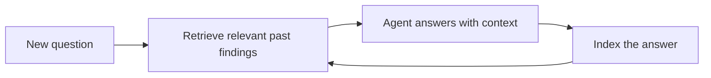

# Build a Research Assistant with Memory

In this tutorial you'll build an assistant that gets smarter as it works. Each answer it produces is indexed into a memory store, and every new question first retrieves the most relevant things it has already learned — so a follow-up question benefits from earlier research instead of starting cold. This is retrieval-augmented generation (RAG), wired in with a few lines of config.

**What you'll build:** a `research.py` where the engine automatically indexes agent output and injects relevant past findings into later prompts — no manual memory plumbing.



!!! note "Prerequisites"
    Install AnyCode on Python 3.12+ and set a provider key. This tutorial's default memory backend is a zero-dependency in-memory index, so you can run it as-is; the persistence step adds `anycode-py[vector]`.

## Step 1: Turn on RAG

RAG lives on the `OrchestratorConfig`. Enable it and pick a vector backend. For the walkthrough we use the in-memory TF-IDF store (no extra dependency) and set `min_relevance=0.0` so early, sparse matches aren't filtered out.

```python title="research.py"
import asyncio

from anycode import AnyCode, OrchestratorConfig, RAGConfig
from anycode.types import MemoryConfig

config = OrchestratorConfig(
    memory=MemoryConfig(vector_backend="memory"),
    rag=RAGConfig(enabled=True, auto_index=True, top_k=3, min_relevance=0.0, namespace="research"),
)
engine = AnyCode(config)
```

| `RAGConfig` field | Here | Why |
| --- | --- | --- |
| `enabled` | `True` | RAG is off by default |
| `auto_index` | `True` | Index each successful answer automatically |
| `top_k` | `3` | Retrieve the three best snippets |
| `min_relevance` | `0.0` | Don't filter matches while the index is small |
| `namespace` | `"research"` | Keep this project's memory separate |

## Step 2: Define the assistant

One agent is enough — the memory does the heavy lifting. Give it a system prompt that tells it to use the context it's handed.

```python title="research.py"
from anycode import AgentConfig, TaskSpec, TeamConfig

assistant = AgentConfig(
    name="researcher",
    provider="anthropic",
    model="claude-haiku-4-5",
    system_prompt=(
        "You are a research assistant. Use any 'Relevant Context from Past Sessions' "
        "provided to give consistent, well-grounded answers. Be concise and factual."
    ),
    tools=[],
)

team = engine.create_team("research", TeamConfig(name="research", shared_memory=True, agents=[assistant]))
```

## Step 3: Teach it something, then ask a follow-up

Run two tasks. The first records domain facts; its output is indexed. The second asks a question whose answer depends on those facts — and AnyCode retrieves and injects them into the prompt automatically.

```python title="research.py"
async def main() -> None:
    # 1) Establish facts. The answer gets indexed into memory.
    await engine.run_tasks(team, [
        TaskSpec(
            title="Record findings",
            description=(
                "Summarize these project decisions so they can be recalled later: "
                "we chose PostgreSQL for storage, event-driven ingestion, and a 30-day data retention policy."
            ),
            assignee="researcher",
        ),
    ])

    # 2) Ask a follow-up. Relevant past findings are retrieved and prepended.
    result = await engine.run_tasks(team, [
        TaskSpec(
            title="Answer follow-up",
            description="Given our earlier decisions, how long do we keep data and what storage do we use?",
            assignee="researcher",
        ),
    ])

    print(result.agent_results["researcher"].output)


asyncio.run(main())
```

Run it:

```bash
uv run python research.py
```

The second answer cites the retention policy and database choice from the *first* run — the assistant "remembered" because the orchestrator indexed the earlier output and retrieved it before answering.

!!! tip "How the injection works"
    On each task, AnyCode retrieves the top matches and prepends them under a `## Relevant Context from Past Sessions` heading before your prompt. That's why the system prompt tells the agent to use that section — it's a real signal, not decoration.

## Step 4: Make the memory persistent

The in-memory store forgets everything on exit. Switch to ChromaDB so the index survives restarts — the assistant then accumulates knowledge across sessions and days.

```python title="research.py"
config = OrchestratorConfig(
    memory=MemoryConfig(vector_backend="chromadb", vector_path="research_index"),
    rag=RAGConfig(enabled=True, top_k=3, namespace="research"),
)
```

Install the backend once with `uv add "anycode-py[vector]"`, and raise `min_relevance` back toward its `0.3` default as the index grows and matches get stronger.

## Where to go next

You built an assistant with a memory that compounds. Extend it with a curated knowledge base the agent writes to explicitly using `build_knowledge_tools`, or add a second "critic" agent that checks answers against retrieved facts before they're returned.

## Next steps

- [Give agents memory and RAG](../guides/memory-and-rag.md) — backends, shared memory, and knowledge tools in depth.
- [Engineer the context window](../guides/context-engineering.md) — budget how much retrieved context enters the prompt.
- [Run a multi-agent team](../guides/multi-agent-team.md) — add a critic or writer to the crew.
- [Configuration reference](../reference/configuration.md) — every `RAGConfig` and `MemoryConfig` field.
