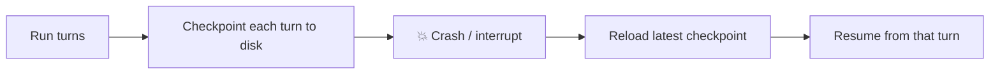

# Build a Resumable Pipeline

Long jobs get interrupted — a machine reboots, a provider times out, someone hits Ctrl-C. In this tutorial you'll build a durable run that records its progress every turn, then prove it can pick up exactly where it left off after a "crash." You'll also inspect the run from the command line, the way you would during an incident.

**What you'll build:** a `pipeline.py` where an agent processes work durably, plus a second script that resumes the very same run from its last checkpoint.



!!! note "Prerequisites"
    Install AnyCode on Python 3.12+. You can run this with a live provider key, or with the built-in `FakeAdapter` for a fully deterministic, offline demo. Do the [Quickstart](../getting-started/quickstart.md) first if agents are new to you.

## Step 1: Assemble a durable runner

Durability attaches to an `AgentRunner`. You give it a `DurabilityConfig` and a `FilesystemRunStore`; from then on it writes a turn checkpoint to disk as it goes. Set `checkpoint_every_turns=1` so every single turn is recoverable.

```python title="pipeline.py"
import asyncio

from anycode import (
    AgentRunner, DurabilityConfig, FilesystemRunStore, RunnerOptions,
    ToolExecutor, ToolRegistry, create_adapter, register_built_in_tools,
)
from anycode.types import LLMMessage, TextBlock

RUN_ROOT = ".anycode/runs"


async def build_runner(store: FilesystemRunStore, resume_from=None) -> AgentRunner:
    adapter = await create_adapter("anthropic")   # or a FakeAdapter for an offline demo
    registry = ToolRegistry()
    register_built_in_tools(registry)
    return AgentRunner(
        adapter,
        registry,
        ToolExecutor(registry),
        RunnerOptions(model="claude-haiku-4-5", agent_name="pipeline-worker", max_turns=12),
        durability=DurabilityConfig(enabled=True, run_root=RUN_ROOT, checkpoint_every_turns=1),
        run_store=store,
        resume_from=resume_from,
    )
```

| `DurabilityConfig` field | Here | Effect |
| --- | --- | --- |
| `enabled` | `True` | Persist the run (required — off by default) |
| `run_root` | `.anycode/runs` | Where run records and checkpoints live |
| `checkpoint_every_turns` | `1` | Save recoverable state every turn |

## Step 2: Start the run

Kick off a multi-step task. As it runs, watch `.anycode/runs/` fill with a run record and per-turn checkpoints.

```python title="pipeline.py"
async def main() -> None:
    store = FilesystemRunStore(RUN_ROOT)
    runner = await build_runner(store)

    messages = [LLMMessage(role="user", content=[TextBlock(
        text="Process this backlog step by step: draft, refine, and finalize a release note. "
             "Work through it methodically, one step per turn."
    )])]

    async for _event in runner.stream(messages):
        pass   # in a real app, render events to the user

    record = store.list_runs()[0]
    print(f"run {record.run_id} finished with status={record.status}")


asyncio.run(main())
```

If this run completes, great. The interesting case is when it *doesn't*.

## Step 3: Survive a crash

Interrupt the process partway through — Ctrl-C, a killed container, a provider outage. Durability has been writing a checkpoint every turn, so the last completed turn is on disk. Inspect it from the CLI exactly as you would in production:

```bash title="During the incident"
anycode runs list                 # find the run and its status
anycode runs show <run_id>        # latest checkpoint, wake condition, recent events
anycode runs tail <run_id>        # replay the transcript
```

A run interrupted mid-flight shows up as `running` with a stale heartbeat, or `paused` if it hit a provider outage (durable runs auto-pause and schedule a retry rather than fail).

## Step 4: Resume exactly where it stopped

Resuming is loading the last `TurnCheckpoint` and handing it to a fresh runner via `resume_from`. The conversation, token usage, turn count, and budget all restore — the agent continues, it does not restart.

```python title="resume.py"
import asyncio

from anycode import FilesystemRunStore
from pipeline import RUN_ROOT, build_runner


async def main() -> None:
    store = FilesystemRunStore(RUN_ROOT)
    record = store.list_runs()[0]

    checkpoint = store.load_latest_checkpoint(record.run_id)
    if checkpoint is None:
        raise SystemExit("No checkpoint found to resume from.")

    runner = await build_runner(store, resume_from=checkpoint)
    result = await runner.run([])   # empty seed — the checkpoint carries the history

    final = store.read_record(record.run_id)
    print(f"resumed and finished: status={final.status}")
    print(result.output)


asyncio.run(main())
```

```bash
uv run python resume.py
```

The resumed run continues from the exact turn it stopped on — no repeated work, no lost progress, no double spend on the turns it already finished.

!!! tip "There is no `anycode runs resume` command"
    Resuming is programmatic, as above (or via a `RunScheduler` that sweeps paused runs and calls your resume function). The CLI's `sweep` reports which runs are due to wake but does not resume them for you.

## Where to go next

You built a run that treats a crash as a pause, not a failure. Scale this up with a `RunScheduler` that automatically resumes paused runs on a timer, or use a `SessionChain` to break a multi-day goal into a sequence of durable, fresh-context sessions.

## Next steps

- [Checkpoint, resume, and schedule durable runs](../guides/durability.md) — session chains, scheduled wakeups, and workflow checkpoints.
- [Track and cap cost](../guides/cost-tracking.md) — durability means you never pay twice for finished turns.
- [Production controls](../guides/production-controls.md) — durability alongside budgets and gates.
- [CLI reference](../reference/cli.md) — the full `anycode runs` command set.
