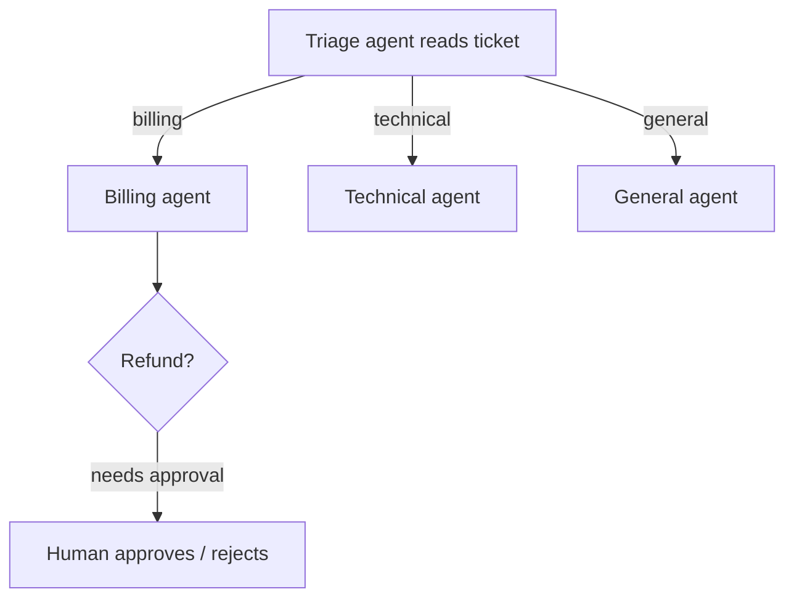

# Build a Support-Triage Bot

In this tutorial you'll build a support system that behaves like a good front desk: a triage agent reads each incoming ticket and hands it to the right specialist, and a sensitive action — issuing a refund — pauses for a human to approve before it happens. It combines three AnyCode capabilities into one believable workflow: **handoff**, **custom tools**, and **human-in-the-loop approval**.

**What you'll build:** a `triage.py` that routes tickets to a billing, technical, or general agent, where the billing agent can only issue a refund after a person signs off.



!!! note "Prerequisites"
    Install AnyCode on Python 3.12+ and set a provider key. Read [Agent handoff](../guides/handoff.md) and [Human-in-the-loop approval](../guides/human-in-the-loop.md) if you want the concepts behind the pieces first.

## Step 1: Build a refund tool that needs approval

The refund is a real side effect, so it's a custom tool. We'll gate it in Step 3 — here we just define it.

```python title="triage.py"
import asyncio
from datetime import UTC, datetime

from pydantic import BaseModel, Field

from anycode import (
    AgentConfig, AnyCode, CallbackApprovalGate, TaskSpec, TeamConfig,
    ToolResult, ToolUseContext, define_tool,
)
from anycode.types import ApprovalConfig, ApprovalRequest, ApprovalResponse


class RefundInput(BaseModel):
    order_id: str = Field(description="The order to refund.")
    amount_usd: float = Field(description="Refund amount in USD.")


async def issue_refund(params: RefundInput, ctx: ToolUseContext) -> ToolResult:
    # A real implementation would call your payments API here.
    return ToolResult(data=f"Refunded ${params.amount_usd:.2f} for order {params.order_id}", is_error=False)


refund_tool = define_tool(
    name="issue_refund",
    description="Issue a refund for an order. Use only when a refund is clearly warranted.",
    input_model=RefundInput,
    execute=issue_refund,
)
```

## Step 2: Define the triage agent and specialists

The triage agent gets the `handoff` tool and a prompt telling it who to delegate to. Each specialist is scoped to just what it needs.

```python title="triage.py"
triage = AgentConfig(
    name="triage",
    provider="anthropic",
    model="claude-haiku-4-5",
    system_prompt=(
        "You triage support tickets. Read the ticket and hand off to exactly one specialist: "
        "'billing' for payments and refunds, 'technical' for bugs and errors, or 'general' for everything else."
    ),
    tools=["handoff"],
)

billing = AgentConfig(
    name="billing",
    provider="anthropic",
    model="claude-sonnet-5",
    system_prompt="Resolve billing issues. Issue a refund only when the ticket clearly justifies one.",
    tools=["issue_refund"],
)

technical = AgentConfig(
    name="technical",
    provider="anthropic",
    model="claude-sonnet-5",
    system_prompt="Diagnose technical issues and give the customer concrete next steps.",
    tools=["file_read", "grep"],
)

general = AgentConfig(
    name="general",
    provider="anthropic",
    model="claude-haiku-4-5",
    system_prompt="Answer general questions politely and concisely.",
    tools=[],
)
```

## Step 3: Gate the refund with human approval

An approval gate intercepts the `issue_refund` tool and waits for a person. Here the handler prints the request and auto-approves for demonstration — in production you'd route it to a dashboard, Slack, or an on-call queue.

```python title="triage.py"
async def review(request: ApprovalRequest) -> ApprovalResponse:
    print(f"\n[APPROVAL NEEDED] {request.agent}: {request.description}")
    # Replace with a real human decision:
    return ApprovalResponse(approved=True, request_id=request.id, responded_at=datetime.now(UTC))


engine = AnyCode(config={
    "max_handoff_depth": 2,
    "approval": ApprovalConfig(enabled=True, require_approval_tools=["issue_refund"]),
    "approval_handler": CallbackApprovalGate(review),
})
```

Only `issue_refund` is listed in `require_approval_tools`, so the technical and general agents run without interruption — the human is asked exactly when it matters.

## Step 4: Run some tickets

Assign each incoming ticket to `triage` and let it hand off. Because the specialists are teammates, the orchestrator runs whichever one triage chooses.

```python title="triage.py"
async def main() -> None:
    team = engine.create_team(
        "support",
        TeamConfig(name="support", shared_memory=True, agents=[triage, billing, technical, general]),
    )

    tickets = [
        "Order #4821 arrived damaged. I want my $59.99 back.",
        "The export button throws a 500 error every time I click it.",
        "What are your support hours?",
    ]

    for ticket in tickets:
        result = await engine.run_tasks(team, [
            TaskSpec(title="Handle ticket", description=ticket, assignee="triage"),
        ])
        print(f"\nTICKET: {ticket}")
        for name, agent_result in result.agent_results.items():
            print(f"  [{name}] {agent_result.output[:200]}")
        for handoff in result.handoffs:
            print(f"  handoff: {handoff.from_agent} -> {handoff.to_agent}")


asyncio.run(main())
```

Run it:

```bash
uv run python triage.py
```

The damaged-order ticket flows triage → billing, and the refund pauses for approval. The 500-error ticket goes to technical, and the hours question to general — each without a human in the loop, because only the refund crosses a trust boundary.

## Where to go next

You built a triage system that delegates intelligently and asks for help at exactly the right moment. Extend it by adding a [routing policy](../guides/routing.md) that sends simple tickets to a cheaper model, or a [verification gate](../guides/verification-gates.md) that checks refund amounts against a policy before the human even sees them.

## Next steps

- [Agent handoff](../guides/handoff.md) — the delegation mechanism in depth.
- [Human-in-the-loop approval](../guides/human-in-the-loop.md) — gates, channels, and timeout policy.
- [Route tasks by complexity](../guides/routing.md) — add model routing on top.
- [Work with tools](../guides/tools.md) — build more custom tools like the refund action.
